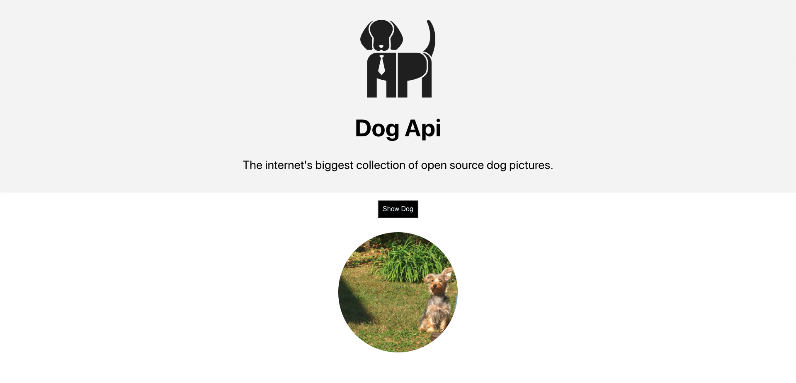

## Dog API 👨🏻‍🍳

The Stanford Dogs dataset contains images of 120 breeds of dogs from around the world. This dataset has been built using images and annotation from ImageNet for the task of fine-grained image categorization.

The preview of the application is given below:

